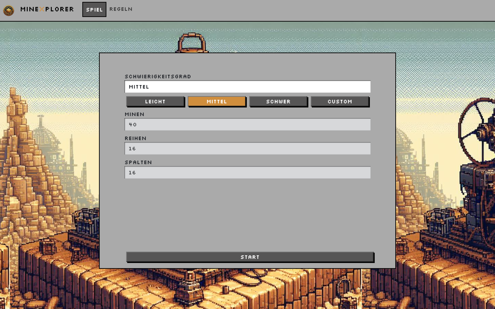
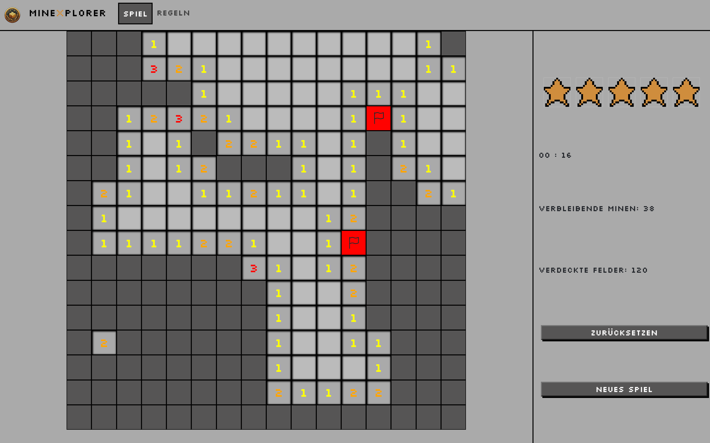

# mineXplorer
<p align="center">
    
</p>

mineXplorer ist eine webbasierten Version des beliebten Spiels Minesweeper.

## Funktionen
Das Spiel verfügt über 3 verschiedene Schwierigkeitsstufen, die den Spielern die Möglichkeit bieten, ihre Erfahrung entsprechend ihren Fähigkeiten und Vorlieben anzupassen.

Darüber hinaus bietet das Spiel die Funktion eines personalisierten Spielfeldes. Spieler haben die Möglichkeit, ihr Spielfeld nach ihren individuellen Präferenzen - gezüglich Speilfeldgröße und Anzahl der Minen - zu gestalten.
<p align="center">
    
    
</p>


## Dokumentation
siehe *Projektdokumentation_MineXplorer.docx*

## App Struktur
Die wichtigsten Dateien und Ordner in dem Projekt sind folgende:

* Die Logik des Spiels ist in der Datei `mineXplorer/src/app/library/classes/gamelogic.ts` spezifiziert.
* Die Komponenten sind unter `mineXplorer/src/app/library/components/` abgelegt:
    * **game-launcher**: Die Hauptkomponente des Spiels. In dieser Komponente wird das Spielfeld für den Nutzer erzeugt und festgelegt, wie auf seine Eingaben reagiert wird. 
    * **result**: Hierbei wird das Popup, das das Ergebnis des Spiels darstellt, definiert. 
    * **rules**: Beeinhaltet die Regeln des Spieles und ist für den Nutzer über die **navbar** zugänglich. 
    * **navbar**: Bildet die grundlegende Navigation zwischen Spiel und Regelwerk. Diese wurde als eigene Komponente realisiert, da sie komponentenübergreifend angezeigt wird.
* Unter `mineXplorer/src/app/library/services/` ist der `game.service` abgelegt, der für die Berechnung der Performance benötigt wird.

## Ausführen

1. Öffnen innerhalb des Containers
2. node_modules installation
    ```shell
    cd mineXplorer/
    npm install
    ```
3. Terminalcommand:

    ```shell
    cd mineXplorer/
    ng serve
    ```

4. Die Applikation läuft dann auf http://localhost:4200/

